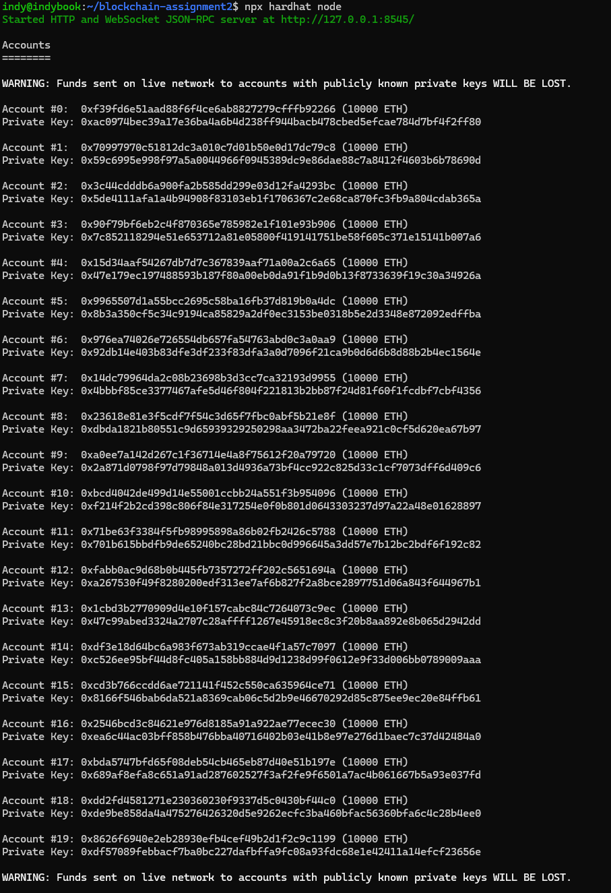

# Assignment 2 – CampusCredit on DIDLab

Assignment 2 replicates the “Analyze Transactions on DIDLab” lab with a fully scripted Hardhat v3
(Viem) workflow. The project deploys an ERC‑20 token to the Team 01 DIDLab network, drives a series
of transfers and approvals, and analyses the resulting gas/fee data. Every artefact the professor
expects (scripts, outputs, screenshots, and the written report) is included in this directory.

## Quick Facts

| Item | Details |
| --- | --- |
| Network | DIDLab Team 01 — `https://hh-01.didlab.org`, chain ID `31337` |
| Token | `CampusCredit` (symbol `CAMP`, 18 decimals, 1,000,000 initial supply) |
| Tooling | Hardhat v3 (ESM) + Viem client, TypeScript scripts |
| Evidence | `deploy-output.txt`, `interact-output.txt`, `analyze-output.txt`, [`report.md`](./report.md), screenshots below |

## Repository Tour

```
Assignment-2/
├── contracts/CampusCredit.sol       # Simple ERC-20 based on OpenZeppelin
├── scripts/                         # Deploy, interact, and analyse scripts (TypeScript)
├── report.md                        # Narrative write-up with tables and screenshots
├── screenshots/                     # PNG captures of each CLI step
├── hardhat.config.ts, tsconfig.json # Hardhat + TypeScript configuration
└── package.json                     # Hardhat v3 + Viem dependencies
```

## Prerequisites

1. **Node.js 22.x LTS** – Hardhat v3 requires Node ≥ 18; the repo was built/tested with Node 22.
2. **DIDLab credentials** – RPC URL, chain ID, faucet private key, and teammate account.
3. **Environment file** – Copy `.env.example` → `.env` and fill in:
   - `RPC_URL`, `CHAIN_ID`, `PRIVATE_KEY`
   - `ACCT2` (teammate address for transfers)
   - `TOKEN_ADDRESS` (populate after deploying)

`.env.example` already contains the Team 01 defaults used to generate the committed outputs, so
Member B can simply drop in their faucet private key.

## Step-by-Step Workflow

> All commands are run from the `Assignment-2/` directory.

### 1. Install & Compile

```bash
npm install
npx hardhat compile
```

Hardhat compiles `CampusCredit.sol` with Solidity 0.8.24. Compilation artefacts are stored under
`artifacts/` (ignored from git).

### 2. Deploy to DIDLab

```bash
npx hardhat run scripts/deploy.ts --network didlab | tee deploy-output.txt
```

The deploy script prints the transaction hash, block number, and the resulting contract address. The
most recent run produced `TOKEN_ADDRESS=0x67D269191c92Caf3cd7723F116c85E6E9BF55933`.


### 3. Generate Transactions

```bash
npx hardhat run scripts/interact.ts --network didlab | tee interact-output.txt
```

This script:
- Transfers **100 CAMP** and **50 CAMP** from the deployer to the teammate (different priority fees).
- Approves **25 CAMP** for the teammate.
- Logs the before/after balances, transaction hashes, block numbers, gas used, and total fees.


### 4. Analyse Fees & Events

```bash
export TX1_HASH=0x3510ce729bec7c4479eda4cfe1b3079e39df0027297b54795ed460d71394adec
export TX2_HASH=0xdb2225f0e0e9d3aedd3736b035a1cde10de98268b179d9c3d404205b621d2a97
export TX3_HASH=0x68f2fcfe83f56aeb99db53cb2aeb2072346eb06d7ff2ee1afdcb9447579866f8
npx hardhat run scripts/analyze.ts --network didlab | tee analyze-output.txt
```

The analyzer fetches full transaction receipts, block metadata, and decoded ERC‑20 logs for each
hash. It also prints the gas usage, effective fee per gas, and total wei spent so the fee comparison
can be copied directly into the report.


### 5. (Optional) Inspect the Local Node

Running a local Hardhat node (`npx hardhat node`) is optional but helpful for dry runs before sending
transactions to DIDLab.



## Report & Submission Checklist

- ✅ **`report.md`** — Summarises the deployment, all three transactions, the fee comparison, decimals
  conversion, and links to evidence (now with embedded screenshots).
- ✅ **`deploy-output.txt` / `interact-output.txt` / `analyze-output.txt`** — Raw console logs captured
  via `tee` for grading transparency.
- ✅ **Screenshots** — PNG captures for deploy, interact, analyze, and optional node sessions.
- ✅ **Source Code** — `contracts/` and `scripts/` show the exact logic used to generate the data.

Re-running these commands with your `.env` values will regenerate every artefact. Update the token
address and hashes in `.env` and `report.md` when submitting your own run.
