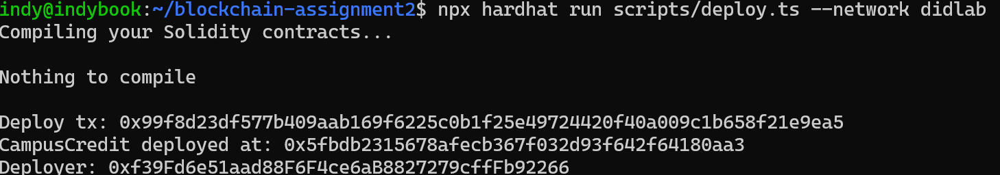
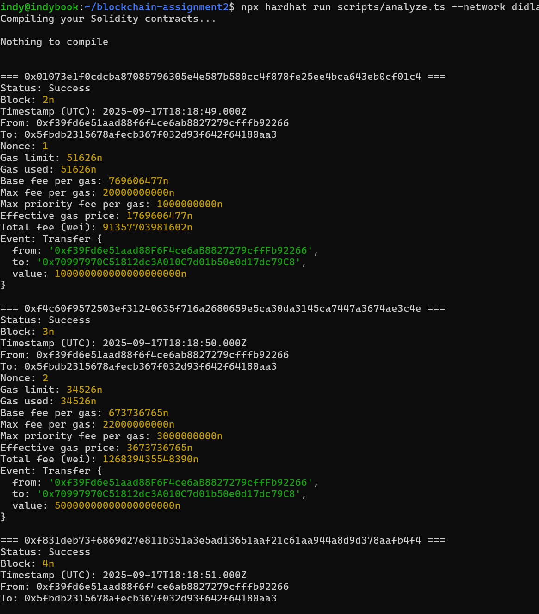

# Assignment 2 — Analyze Transactions on DIDLab

_All runs were executed directly against the DIDLab Team 01 network (`https://hh-01.didlab.org`, chain
ID `31337`) using the Hardhat v3 + Viem toolchain committed in this repository._

## Environment Snapshot

| Item | Value |
| --- | --- |
| Solidity compiler | 0.8.24 (optimizer 200 runs) |
| Hardhat | v3 with ESM + Viem client |
| Accounts | Deployer `0xf39F…2266`, teammate `0x7099…79C8` |
| Token | `CampusCredit` (`CAMP`, 18 decimals, 1,000,000 supply) |

## Part A — Deployment

| Field | Value |
| --- | --- |
| Contract address | `0x67D269191c92Caf3cd7723F116c85E6E9BF55933` |
| Deployment tx | `0x8874714ebb621f90ffda75b2f915de30c9e935eb7d328532588e9a732c338f17` (block `30`) |
| Deployer | `0xf39F…2266` |
| Gas used | `1,195,552` (fee `49,180,080,000,000 wei`) |

## Part B — Transactions & Events

### Summary Table

| Tx | Action | Hash | Block (UTC) | Gas Used | Effective Price | Total Fee |
| --- | --- | --- | --- | --- | --- | --- |
| 1 | Transfer 100 CAMP to teammate | `0x3510ce729bec7c4479eda4cfe1b3079e39df0027297b54795ed460d71394adec` | `31` (`2025-09-21T16:05:41Z`) | `51,626` | `1.016534465 gwei` | `52,479,608,290,090 wei` |
| 2 | Transfer 50 CAMP to teammate | `0xdb2225f0e0e9d3aedd3736b035a1cde10de98268b179d9c3d404205b621d2a97` | `32` (`2025-09-21T16:05:42Z`) | `34,526` | `3.014474771 gwei` | `104,077,755,943,546 wei` |
| 3 | Approve 25 CAMP for teammate | `0x68f2fcfe83f56aeb99db53cb2aeb2072346eb06d7ff2ee1afdcb9447579866f8` | `33` (`2025-09-21T16:05:43Z`) | `46,379` | `2.012669590 gwei` | `93,345,602,914,610 wei` |

### Key Observations

- **Balances:** Deployer dropped from `1,000,000 CAMP` to `999,825 CAMP` after the transfers; teammate
  climbed from `0` to `150 CAMP` with an additional `25 CAMP` allowance.
- **Events:** Each transaction emitted the expected `Transfer`/`Approval` events, decoded via Viem in
  the analyzer script.

## Part C — Fee Comparison (Tx1 vs Tx2)

| Metric | Tx1 | Tx2 | Notes |
| --- | --- | --- | --- |
| Max Priority Fee | 1 gwei | 3 gwei | Higher tip on Tx2 encouraged faster inclusion. |
| Base Fee | 0.016534465 gwei | 0.014474771 gwei | Block base fee adjusted slightly downward block-to-block. |
| Effective Gas Price | 1.016534465 gwei | 3.014474771 gwei | `min(maxFee, base + tip)` per EIP-1559. |
| Total Wei Paid | 52,479,608,290,090 | 104,077,755,943,546 | Tx2 spent ~2× the wei for a higher priority fee. |

## Part D — Decimals & Conversion

- Raw value from Tx1: `100000000000000000000`
- Token decimals: `18`
- Human-readable: `raw / 10^18 = 100 CAMP`

## Evidence Bundle

- [`deploy-output.txt`](./deploy-output.txt) — raw console output from the deployment.
- [`interact-output.txt`](./interact-output.txt) — transfer and approval details with balances.
- [`analyze-output.txt`](./analyze-output.txt) — block metadata, gas usage, and decoded logs.
- [`screenshots/cli/`](./screenshots/cli/) — PNG captures for every CLI step.

Re-run the scripts with your own DIDLab credentials to regenerate the data. Update the hashes in
`.env` and within this report when submitting your personalised run.
