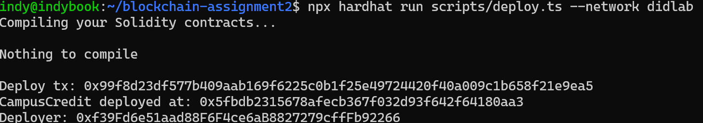
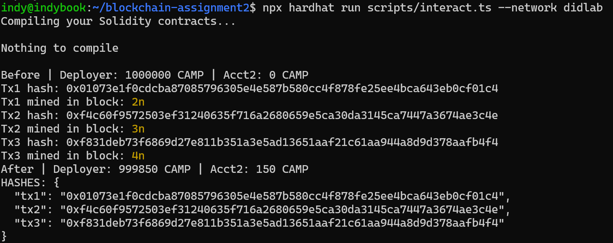
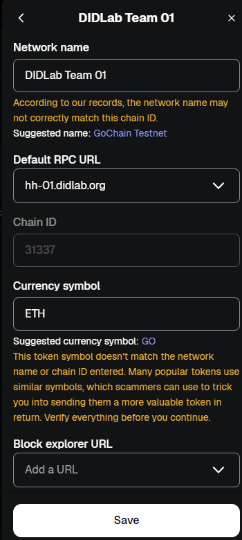
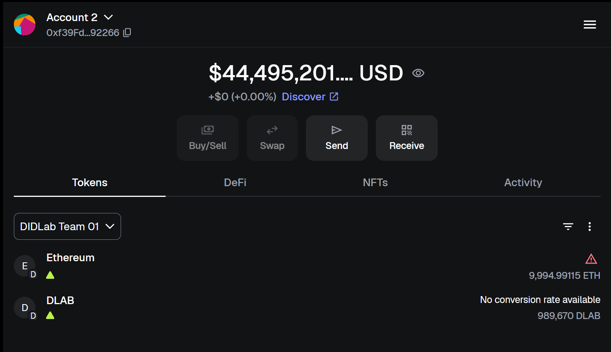
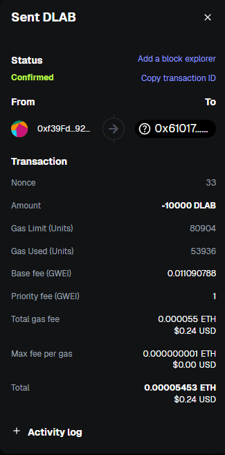

# Assignment 3 — Production-Style ERC-20 on DIDLab

Assignment 3 scales the DIDLab workflow into a production-style ERC‑20 with supply cap, pausing, role
management, and an optimized batch airdrop. Everything is automated with Hardhat v3 (ESM) and Viem so
that the professor can reproduce the exact deployment, operations, and analysis steps from the
repository.

## Quick Facts

| Item | Details |
| --- | --- |
| Network | DIDLab Team 01 — `https://hh-01.didlab.org`, chain ID `31337` |
| Token | `CampusCreditV2` (`DidLabToken`, symbol `DLAB`, cap 2,000,000) |
| Features | Capped supply, pausability, role-based minting, gas-aware batch airdrop |
| Tooling | Hardhat v3 (ESM) + Viem + TypeScript scripts |
| Evidence | `report.md`, CLI outputs (`*-output.txt`), screenshots (`screenshots/*.png`) |

## Repository Tour

```
Assignment-3/
├── contracts/CampusCreditV2.sol    # ERC-20 with cap, pause, AccessControl, and batch airdrop helper
├── scripts/                        # deploy, transfer/approve, airdrop, and logs query scripts
├── report.md                       # Detailed runbook with tables & embedded screenshots
├── screenshots/                    # CLI + MetaMask evidence
├── hardhat.config.ts               # Solidity 0.8.24 + DIDLab network configuration
└── package.json                    # Hardhat v3 + Viem dependencies
```

## Setup

1. **Install dependencies**
   ```bash
   npm install
   ```
2. **Create `.env`** by copying `.env.example` and filling in:
   - `RPC_URL`, `CHAIN_ID`, `PRIVATE_KEY`
   - `TOKEN_NAME`, `TOKEN_SYMBOL`, `TOKEN_CAP`, `TOKEN_INITIAL`
   - Optional `RECIPIENT` (used by transfer/approve script) and `AIRDROP_RECIPIENTS`
   - After deploying, append `TOKEN_ADDRESS`
3. **Compile the contracts**
   ```bash
   npm run compile
   ```

`hardhat.config.ts` already exposes the `didlab` network, pulling connection details from the
environment file.

## Workflow

> Commands below are executed inside `Assignment-3/`.

### 1. Deploy with EIP-1559 Fees

```bash
npm run deploy | tee deploy-output.txt
```

The script deploys `CampusCreditV2`, prints the transaction hash, block, and contract address, and
assigns admin/minter/pauser roles to the deployer.



### 2. Transfer & Approve Script

```bash
npm run xfer | tee transfer-approve-output.txt
```

- Transfers **100 DLAB** to the teammate (balance delta shown).
- Approves **50 DLAB** allowance for the teammate.
- Logs gas used, fees paid, and the decoded events for transparency.



### 3. Batch Airdrop vs Singles

```bash
npm run airdrop | tee airdrop-output.txt
```

The script mints tokens via the smart-contract `airdrop` helper and immediately replays the
distribution as individual transfers. It calculates gas totals and percentage savings to showcase the
benefit of batching.


### 4. Logs & Event History

```bash
npm run logs | tee logs-query-output.txt
```

This command scans recent blocks for `Transfer` and `Approval` events, verifying that on-chain history
matches the scripted interactions.


### 5. MetaMask Verification

Screenshots under `screenshots/` demonstrate the DIDLab network configuration, token import, and an
on-chain token transfer performed via MetaMask.

| Screenshot | Description |
| --- | --- |
|  | Custom network with RPC `https://hh-01.didlab.org` and chain ID `31337`. |
|  | `DidLabToken (DLAB)` imported using the deployed address. |
|  | MetaMask transaction hash aligning with the CLI logs. |

## Submission Checklist

- ✅ `report.md` — comprehensive narrative with tables, gas analysis, and embedded screenshots.
- ✅ Output files — `deploy-output.txt`, `transfer-approve-output.txt`, `airdrop-output.txt`,
  `logs-query-output.txt` (captured via `tee`).
- ✅ Source — contracts and scripts that generated every artefact.
- ✅ Screenshots — CLI evidence (`screenshots/cli-*.png`) plus MetaMask proof.

Follow the workflow with your own `.env` secrets to regenerate the data; update `TOKEN_ADDRESS` and
report hashes before submission.
