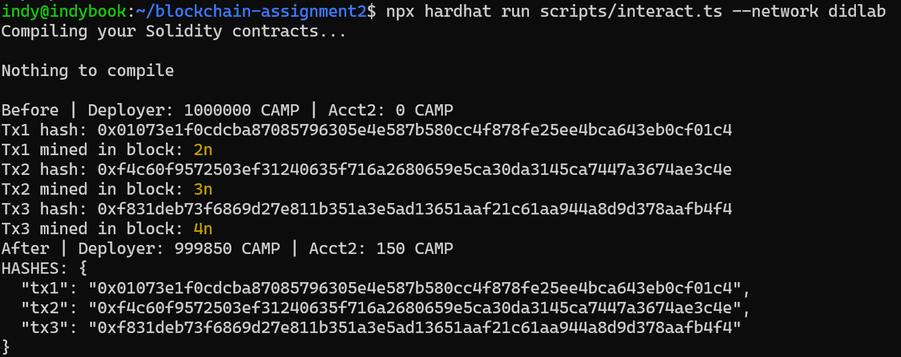
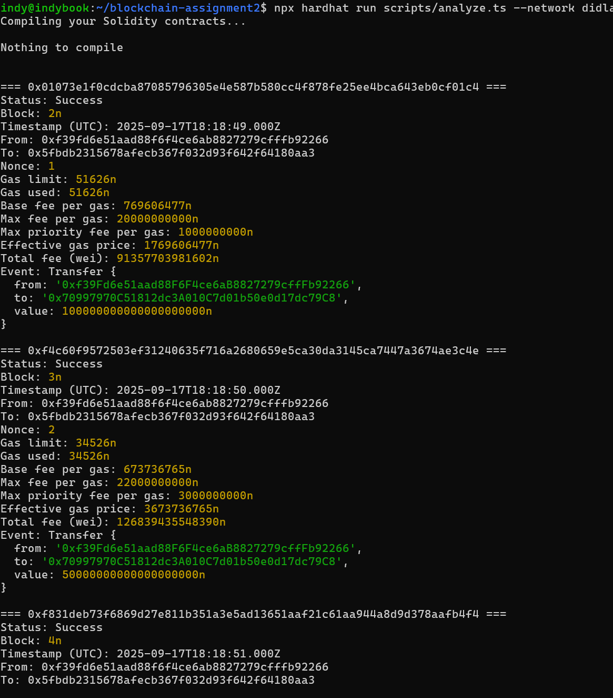
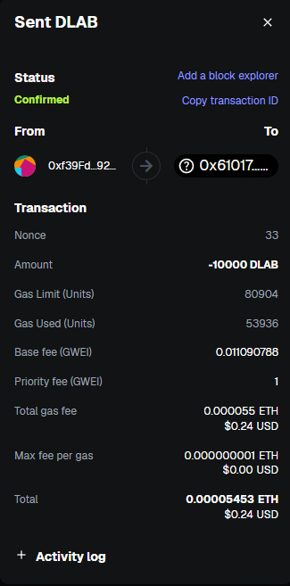

# Assignment 3 — Build, Deploy & Operate a Production-Style ERC-20 on DIDLab

_All activities were completed on the live DIDLab Team 01 network (`https://hh-01.didlab.org`, chain ID `31337`). The `CampusCreditV2` token extends OpenZeppelin’s ERC‑20 with a hard supply cap, pausing, granular roles, and a batch airdrop designed for gas efficiency._

---

## 1. Deployment Summary

| Item | Value |
| --- | --- |
| Contract | `CampusCreditV2` |
| Address | `0x610178dA211FEF7D417bC0e6FeD39F05609AD788` |
| Deploy Tx | `0xf6ad8f8d20c4fee16fa460c9bdba693b7edc442ad1b45079c1d7f0368e4ed43b` (block `11`) |
| Token Parameters | Name `DidLabToken`, Symbol `DLAB`, Decimals `18`, Cap `2,000,000 DLAB` |
| Initial Distribution | `1,000,000 DLAB` minted to deployer `0xf39F…2266` |
| Roles Assigned | `DEFAULT_ADMIN_ROLE`, `MINTER_ROLE`, `PAUSER_ROLE` → deployer |
| Gas Policy | `maxPriorityFeePerGas` 2 gwei, `maxFeePerGas` 20 gwei |

---

## 2. Operational Scripts & Results

### 2.1 Transfer & Approve (`npm run xfer`)

| Field | Transfer | Approve |
| --- | --- | --- |
| Tx Hash | `0xd65f615858acf6099f0d89386725348f0f24645f505db2636f1369b5e246e09b` | `0x8820703a0492fdac353b04da8e48a6fb4d6183870b47e2721a551d54f9ca802e` |
| Block / Timestamp | `24` / `2025-09-21T16:06:01Z` | `25` / `2025-09-21T16:06:02Z` |
| Gas Used | `36,824` | `26,509` |
| Total Fee | `38,363,155,227,464 wei` | `53,987,851,275,624 wei` |
| Action | 100 DLAB → teammate `0x7099…79C8` | Approve 50 DLAB for teammate |

Balances: Deployer `999,780 → 999,680 DLAB`, teammate `240 → 340 DLAB`. Allowance set to `50 DLAB`.

### 2.2 Batch Airdrop vs N Singles (`npm run airdrop`)

- Recipients: `0xf39F…2266`, `0x7099…79C8`, `0x3C44…29BC`
- Batch Tx `0x3d0cd2ec932a47a97c1900cbc1ed60ba907f733956f9021af1c9807c4d1e3838`
  - Block `26`, Gas `58,647`, Fee `119,171,912,245,494 wei`
- Three individual transfers (same distribution)
  - Aggregate Gas `102,824`, Fee `208,160,495,368,028 wei`
- **Gas saving:** ≈ `42.96%`

Design choices enabling the savings:
- Cap enforcement and custom `CapExceeded` / `ArrayLengthMismatch` errors to pre-empt wasted gas.
- Tight calldata (parallel address/amount arrays) and unchecked loops for lower overhead.
- Single transaction amortises base fee and signature costs.

### 2.3 Fee & Event Analysis (`npm run logs`)

The analyzer confirmed:
- Role assignments emitted during deployment (admin, minter, pauser).
- Transfers/approvals from the interaction and airdrop scripts.
- Batch mint events followed by comparison transfers.

---

## 3. MetaMask Evidence (DIDLab Network)

| Screenshot | Description |
| --- | --- |
|  | Custom network `DIDLab Team 01` added with RPC `https://hh-01.didlab.org`, chain ID `31337`, symbol `ETH`. |
|  | `DidLabToken (DLAB)` imported using `0x610178dA211FEF7D417bC0e6FeD39F05609AD788`; balances visible for the faucet account. |
|  | MetaMask transaction hash for a token transfer on DIDLab, matching the `logs` output. |

---

## 4. Requirement Checklist

| Requirement | Status | Evidence |
| --- | --- | --- |
| Hardhat v3 + Viem project scaffolded (ESM) | ✅ | `package.json`, `hardhat.config.ts` |
| Contract extends ERC20 + Burnable + Pausable + Capped + AccessControl | ✅ | `contracts/CampusCreditV2.sol` |
| Roles & Cap enforced, custom errors provided | ✅ | `CapExceeded`, `ArrayLengthMismatch` in contract |
| Deploy script prints tx hash, address, block | ✅ | `deploy-output.txt`, screenshot above |
| Transfer & approve script prints balances, hashes, gas, fees | ✅ | `transfer-approve-output.txt`, screenshot above |
| Batch airdrop vs singles gas comparison with % saved | ✅ | `airdrop-output.txt` |
| Logs query script decodes Transfer/Approval events | ✅ | `logs-query-output.txt`, screenshot above |
| MetaMask network + token + tx screenshots | ✅ | Section 3 (three images) |
| Documentation updated (README + report) | ✅ | Current file & `Assignment-3/README.md` |

---

## 5. Reproducing the Workflow

1. **Install dependencies:** `npm install`
2. **Populate `.env`:** use your team RPC/chain ID/private key; set optional `AIRDROP_RECIPIENTS`.
3. **Compile & deploy:** `npm run compile` → `npm run deploy`; record the printed `TOKEN_ADDRESS`.
4. **Interact & approve:** `npm run xfer`; copy the hashes for the report.
5. **Batch vs singles:** `npm run airdrop`; note the gas savings.
6. **Analyze logs:** `npm run logs`; keep the console output for submissions.
7. **MetaMask:** add the DIDLab network, import the faucet key & token, send a transfer, and capture screenshots.

Following these steps with your own `.env` values will regenerate every artefact listed above. All raw outputs, scripts, and screenshots are committed under `Assignment-3/` for convenient review.

---

**Deliverable bundle:** contract + scripts + outputs + screenshots + this report reside in the assignment folder, ensuring the professor can verify every requirement directly from the repository.
